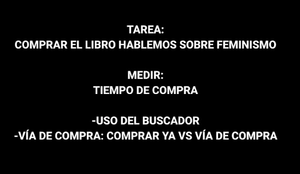
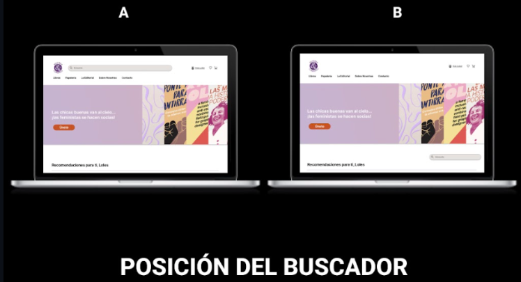
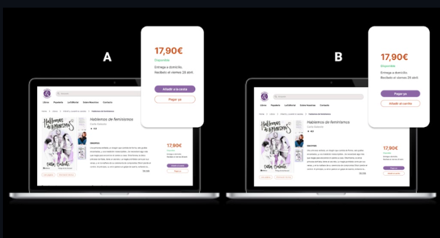
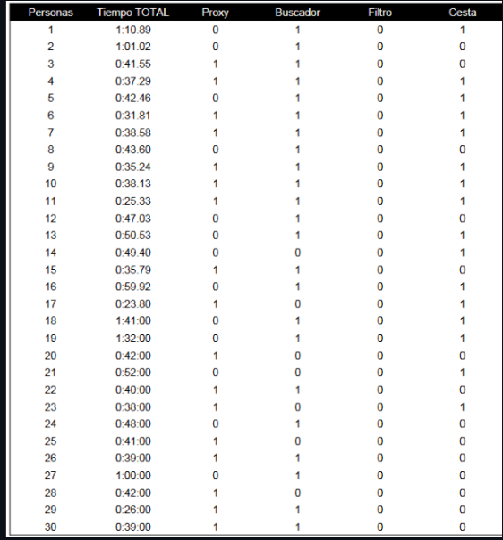
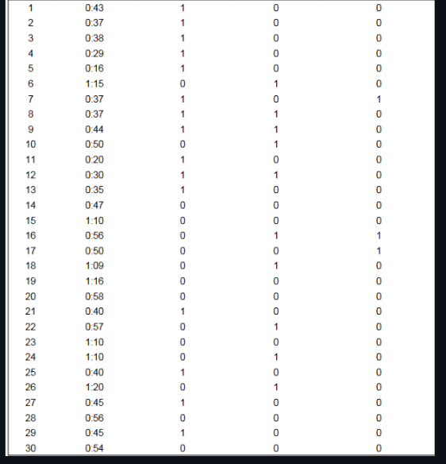
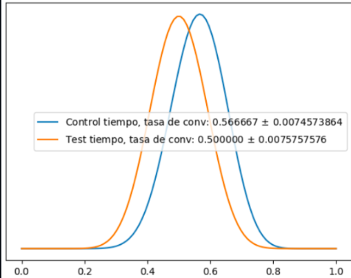
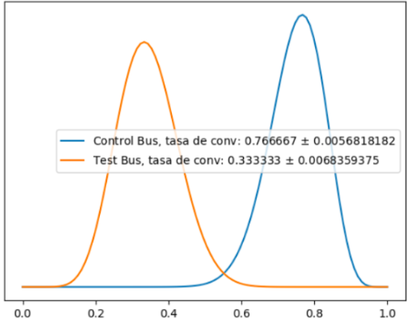
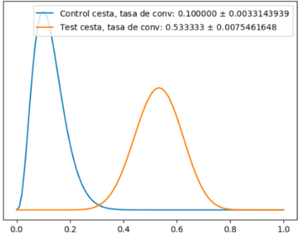

# CRO-Project

## Índice

1. [Descripción](#descripción)
2. [Objetivo principal](#objetivo)
3. [Análisis](#análisis)
4. [Datos](#datos)
5. [Gráficos](#gráficos)
6. [Conclusiones](#conclusiones)

<a name="descripción"/>

## Descripción

En el siguiente proyecto, hemos trabajado conjuntamente con el equipo de UX/UI para analizar cuál diseño de una página web tiene mayor tasa de conversión.

El equipo de UX/UI ya tenía definido el proyecto, que consistía en una librería feminista. Nuestro objetivo como analista de datos era medir el tiempo que un cliente tardaba en realizar una compra de un libro específico. Posteriormente, haríamos cambios en la página y analizaríamos cómo afectan al proceso de compra.

<a name="objetivo"/>

## Objetivo principal

El objetivo principal del equipo de UX/UI era implementar cambios efectivos que reduzcan el tiempo que los clientes pasan en la página web y hagan que el proceso de compra sea más eficiente.

<b>TAREA A REALIZAR</b>

 

 

<a name="análisis"/>

## Análisis

El equipo de UX/UI realizó los siguientes cambios: 

 

### Encuestas

En este proyecto, llevamos a cabo encuestas rápidas con transeúntes para simular una compra ficticia. Primero, realizamos las encuestas con la página web A, recopilando datos de diferentes individuos y midiendo los valores específicos. Una vez finalizado este test con la página web A y con los datos correspondientes, procedimos a realizar las encuestas con la página web B, midiendo los valores correspondientes pero con modificaciones en comparación con la página web A. De esta manera, logramos recopilar datos de ambas páginas web en los distintos aspectos que deseábamos poner a prueba.

Los factores que medimos incluyeron:

  1. 
<b>Tiempo de compra:</b> Registrábamos el tiempo transcurrido desde que la persona ingresaba a la página hasta que finalizaba la compra. El tiempo se medía en términos horarios (minutos:segundos), mientras que el resto de las variables se registraban en términos binarios (1 si se usaba o 0 si no se usaba).

  2. 
<b>Uso de la barra de búsqueda:</b> Registramos si la persona utilizaba o no la barra de búsqueda para encontrar un libro específico.

  3. 
<b>Método de compra:</b> Indagamos si, una vez que la persona encontraba el libro deseado, utilizaba la opción 'Añadir a la cesta' o la opción 'Pagar ya'.

<a name="datos"/>

## Datos

### Test A

<b>DATOS DEL TEST A</b>

 

 

1. 
<b>Análisis del tiempo:</b> Con respecto a la media, que es de 42 segundos, tenemos 17 personas que convierten antes de la media y 13 que tardan más de la media en convertir. Deducimos así, junto con Bayes, que nuestra tasa de conversión es mayor al 56%.

2. 
<b>Análisis del buscador:</b> Nos interesa saber la importancia que tiene el buscador y qué porcentaje de gente lo usa para llegar al producto. Tenemos 23 personas que hacen uso del buscador y 7 que no. Deducimos así, junto con Bayes, que nuestra tasa de uso del buscador es mayor al 75%.

3. 
<b>Análisis del pago:</b> Nos interesa saber cuánta gente utiliza el apartado 'Añadir a la cesta' frente al apartado 'Pagar ya'. Tenemos 16 personas que hacen uso del apartado 'Añadir a la cesta' y 14 que no. Deducimos así, junto con Bayes, que nuestra tasa de uso del apartado 'Añadir a la cesta' es mayor al 53%.

### Test B

<b>DATOS DEL TEST B</b>

 

 

1. 
<b>Análisis del tiempo:</b> Con respecto a la media, que es de 46 segundos, tenemos 15 que convierten antes de la media y 15 que tardan más de la media en convertir. Deducimos así, junto con Bayes, que nuestra tasa de conversión es del 50%.

2. 
<b>Análisis del buscador:</b> Nos interesa saber la importancia que tiene el buscador y qué porcentaje de gente lo usa para llegar al producto. Tenemos 10 personas que hacen uso del buscador y 20 que no. De esta manera, deducimos, junto con Bayes, que nuestra tasa de uso del buscador es mayor al 33%.

3. 
<b>Análisis del pago:</b> Nos interesa saber cuánta gente utiliza el apartado 'Añadir a la cesta' frente al apartado 'Pagar ya'. Tenemos 3 personas que hacen uso del apartado 'Añadir a la cesta' y 27 que no. Deducimos así, junto con Bayes, que nuestra tasa de uso del apartado 'Añadir a la cesta' es del 10%.

<a name="gráficos"/>

## Gráficos

### Tiempo

### Buscador

### Pago

<a name="conclusiones"/>

## Conclusiones

1.  Con los cambios realizados en el test B, se reduce el tiempo en un 11% con una probabilidad del 69.44%.
2.  Con los cambios realizados en el test B, se reduce el número de veces que se usa el buscador en un 54% con una probabilidad del 99.96%.
3.  Con los cambios realizados en el test B, se reduce el número de veces que se usa el apartado 'Añadir a la cesta' en un 76% con una probabilidad del 99.99%.